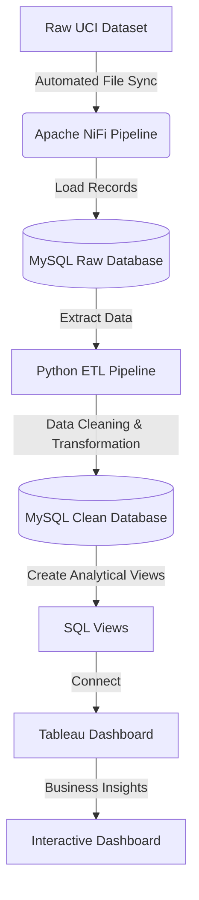

# 🛍️ E-Commerce Analytics Dashboard

### Data Pipeline using Apache NiFi, MySQL, Python, SQL & Tableau

## 📖 Overview

This project demonstrates an end-to-end data analytics pipeline for an e-commerce company specializing in unique all-occasion gifts. It covers the complete analytics workflow, from automated data ingestion and ETL to SQL-based business analysis and interactive Tableau dashboards.

The project uses the **UCI Online Retail Dataset** to extract actionable business insights related to sales performance, customer behavior, product demand, customer segmentation, and revenue trends.

## 🚀 Tech Stack

| Technology | Purpose |
|------------|---------|
| Apache NiFi | Automated data ingestion |
| MySQL | Raw and cleaned data storage |
| Python (Pandas) | Data cleaning and preprocessing |
| SQL | Analytical queries and business insights |
| Tableau | Interactive dashboards and visualization |

---

## 📌 Project Architecture



---

## 📂 Project Structure

```text
├── E-commerce_Sales_Analysis.sql
├── Online Retail.xlsx
├── Online Retail_clean.csv
├── cleaning_data.ipynb
├── README.md
└── Tableau_E_Commerce_Analytics_Dashboard/
    ├── E_commerce_analytics_Dashboard.twb
    ├── E_Commerce_Analytics_Dashboard_queries.sql
    └── E-commerce Analytics Dashboard.png
```

---

## 📊 Dataset

**Dataset:** Online Retail Dataset

**Source:** https://archive.ics.uci.edu/dataset/352/online+retail

**Records:** ~541,909 transactions

**Time Period:** December 2010 to December 2011

The dataset contains transaction-level information from a UK-based online retailer selling unique all-occasion gifts. Key fields include:

- Invoice Number
- Stock Code
- Product Description
- Quantity
- Invoice Date
- Unit Price
- Customer ID
- Country

---

## ⚙️ Project Workflow

### 1️⃣ Data Ingestion (Apache NiFi)

- Monitor the dataset folder using **GetFile**
- Load records into MySQL using **PutDatabaseRecord**
- Store raw transaction data in a staging database

### 2️⃣ Data Cleaning & ETL (Python)

Data preprocessing was performed using **Pandas**.

Tasks performed:

- Handling missing Customer IDs
- Removing duplicate records
- Standardizing text values
- Optimizing data types
- Exporting cleaned data
- Loading cleaned data into MySQL

Install dependencies:

```bash
pip install pandas sqlalchemy mysql-connector-python openpyxl
```

### 3️⃣ Business Analysis (SQL)

SQL views were created for Tableau reporting, including:

- Monthly Sales
- Customer Segmentation
- Country-wise Revenue
- Top Selling Products
- Monthly Repeat Purchases
- Customer Churn Analysis

Example:

```sql
CREATE VIEW MonthlySales AS
SELECT
    DATE_FORMAT(
        STR_TO_DATE(InvoiceDate,'%m/%d/%y %H:%i'),
        '%Y-%m'
    ) AS Month,
    SUM(Quantity * UnitPrice) AS TotalRevenue
FROM Online_Retail_clean
GROUP BY Month;
```

### 4️⃣ Dashboard Development (Tableau)

The Tableau dashboard includes interactive visualizations for:

- 📈 Monthly Sales Trends
- 🌍 Country-wise Revenue
- 🛒 Top Selling Products
- 👥 Customer Segmentation
- 💰 Revenue Distribution
- 🔁 Repeat Purchase Analysis
- 📊 Business KPIs

---

## 📈 Dashboard Preview


---

## 💡 Key Business Insights

- Sales increase significantly during the holiday season, peaking between **October and November**.
- A relatively small group of customers contributes a large portion of total revenue.
- Repeat customers play a major role in overall sales.
- Customers inactive for more than **180 days** can be classified as churned.
- Revenue distribution across countries helps identify high-value markets.

---

## 🛠️ Installation

### Prerequisites

- Python 3.10+
- MySQL Server 8.0+
- Apache NiFi
- Tableau Desktop or Tableau Public

Clone the repository:

```bash
git clone https://github.com/<your-username>/<repository-name>.git
cd <repository-name>
```

Install required Python packages:

```bash
pip install pandas sqlalchemy mysql-connector-python openpyxl
```

---

## ▶️ How to Run

### Step 1

Import the raw dataset into MySQL using the Apache NiFi pipeline.

### Step 2

Run the notebook:

```text
cleaning_data.ipynb
```

This cleans the data and loads it into MySQL.

### Step 3

Execute:

```text
Tableau_E_Commerce_Analytics_Dashboard/E_Commerce_Analytics_Dashboard_queries.sql
```

to create the SQL views used by Tableau.

### Step 4

Open:

```text
Tableau_E_Commerce_Analytics_Dashboard/E_commerce_analytics_Dashboard.twb
```

Update the MySQL connection credentials and explore the dashboard.

---

## 🎯 Skills Demonstrated

- Apache NiFi ETL Automation
- Data Cleaning with Python (Pandas)
- MySQL Database Design
- SQL Query Writing
- SQL View Creation
- Customer Segmentation
- Sales Analytics
- Business Intelligence
- Tableau Dashboard Development
- Data Visualization

---

## 📚 Future Improvements

- Deploy the pipeline using Docker
- Schedule ETL jobs with Apache NiFi
- Build predictive sales forecasting models
- Publish the dashboard using Tableau Server or Tableau Public
- Integrate real-time streaming data

---

## 📄 License

This project is intended for educational and portfolio purposes.
